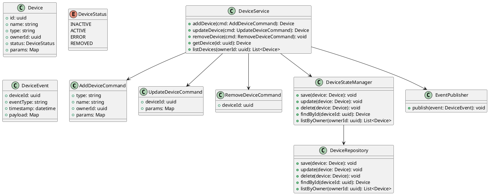

# Уровень кода Device Service — Command Handler

**Device Service** Обрабатывает команды добавления, обновления, удаления устройств, 
валидирует входные данные, транслирует задачи в manager/repository, инициирует публикацию событий.

## Device Service: Command Handler - UML (Class Diagram)

