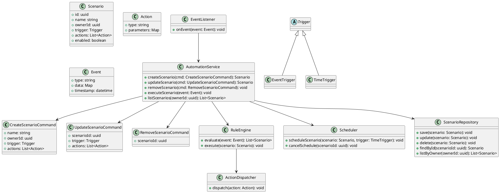

# Уровень кода Automation Service — Rule Engine

**Automation Service** обрабатывает события/триггеры, выбирает и выполняет сценарии, вызывает действия.

## Automation Service: Rule Engine

```puml
@startuml

' --- Команды управления сценарием ---
class CreateScenarioCommand {
    +name: string
    +ownerId: uuid
    +trigger: Trigger
    +actions: List<Action>
}

class UpdateScenarioCommand {
    +scenarioId: uuid
    +trigger: Trigger
    +actions: List<Action>
}

class RemoveScenarioCommand {
    +scenarioId: uuid
}

' --- Основные сервисы ---
class AutomationService {
    +createScenario(cmd: CreateScenarioCommand): Scenario
    +updateScenario(cmd: UpdateScenarioCommand): Scenario
    +removeScenario(cmd: RemoveScenarioCommand): void
    +executeScenario(event: Event): void
    +listScenarios(ownerId: uuid): List<Scenario>
}

AutomationService --> CreateScenarioCommand
AutomationService --> UpdateScenarioCommand
AutomationService --> RemoveScenarioCommand

class RuleEngine {
    +evaluate(event: Event): List<Scenario>
    +execute(scenario: Scenario): void
}

AutomationService --> RuleEngine

class Scheduler {
    +scheduleScenario(scenario: Scenario, trigger: TimeTrigger): void
    +cancelSchedule(scenarioId: uuid): void
}

AutomationService --> Scheduler

class EventListener {
    +onEvent(event: Event): void
}
EventListener --> AutomationService

class ActionDispatcher {
    +dispatch(action: Action): void
}
RuleEngine --> ActionDispatcher

class ScenarioRepository {
    +save(scenario: Scenario): void
    +update(scenario: Scenario): void
    +delete(scenario: Scenario): void
    +findById(scenarioId: uuid): Scenario
    +listByOwner(ownerId: uuid): List<Scenario>
}

AutomationService --> ScenarioRepository

' --- Основные доменные классы ---
class Scenario {
    +id: uuid
    +name: string
    +ownerId: uuid
    +trigger: Trigger
    +actions: List<Action>
    +enabled: boolean
}

abstract class Trigger
class EventTrigger
class TimeTrigger
Trigger <|-- EventTrigger
Trigger <|-- TimeTrigger

class Action {
    +type: string
    +parameters: Map
}

class Event {
    +type: string
    +data: Map
    +timestamp: datetime
}

@enduml
```