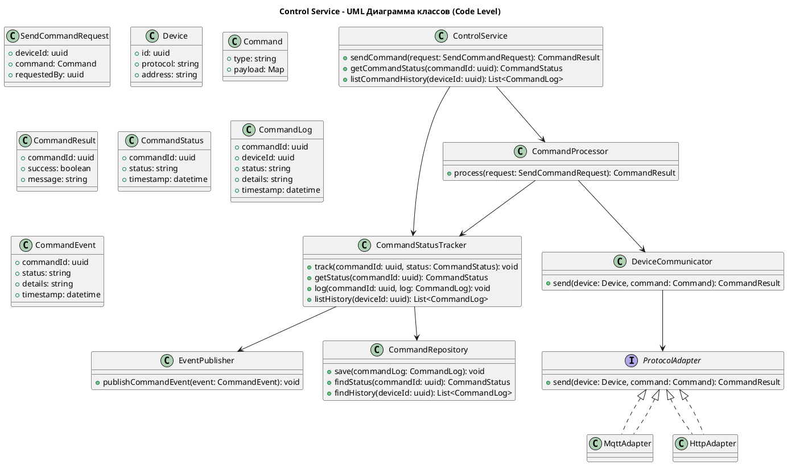

# Уровень кода Control Service

**Control Service** ключевой микросервис для управления физическими устройствами.

## UML Диаграмма классов Control Service

```puml
@startuml
title Control Service – UML Диаграмма классов (Code Level)

' --- Команды управления устройствами ---
class SendCommandRequest {
    +deviceId: uuid
    +command: Command
    +requestedBy: uuid
}

' --- Основные сервисы ---
class ControlService {
    +sendCommand(request: SendCommandRequest): CommandResult
    +getCommandStatus(commandId: uuid): CommandStatus
    +listCommandHistory(deviceId: uuid): List<CommandLog>
}

ControlService --> CommandProcessor
ControlService --> CommandStatusTracker

class CommandProcessor {
    +process(request: SendCommandRequest): CommandResult
}

CommandProcessor --> DeviceCommunicator
CommandProcessor --> CommandStatusTracker

class DeviceCommunicator {
    +send(device: Device, command: Command): CommandResult
}

DeviceCommunicator --> ProtocolAdapter

interface ProtocolAdapter {
    +send(device: Device, command: Command): CommandResult
}

class MqttAdapter implements ProtocolAdapter
class HttpAdapter implements ProtocolAdapter

ProtocolAdapter <|.. MqttAdapter
ProtocolAdapter <|.. HttpAdapter

class CommandStatusTracker {
    +track(commandId: uuid, status: CommandStatus): void
    +getStatus(commandId: uuid): CommandStatus
    +log(commandId: uuid, log: CommandLog): void
    +listHistory(deviceId: uuid): List<CommandLog>
}

class EventPublisher {
    +publishCommandEvent(event: CommandEvent): void
}
CommandStatusTracker --> EventPublisher

class CommandRepository {
    +save(commandLog: CommandLog): void
    +findStatus(commandId: uuid): CommandStatus
    +findHistory(deviceId: uuid): List<CommandLog>
}
CommandStatusTracker --> CommandRepository

' --- Модели ---
class Device {
    +id: uuid
    +protocol: string
    +address: string
}

class Command {
    +type: string
    +payload: Map
}

class CommandResult {
    +commandId: uuid
    +success: boolean
    +message: string
}

class CommandStatus {
    +commandId: uuid
    +status: string
    +timestamp: datetime
}

class CommandLog {
    +commandId: uuid
    +deviceId: uuid
    +status: string
    +details: string
    +timestamp: datetime
}

class CommandEvent {
    +commandId: uuid
    +status: string
    +details: string
    +timestamp: datetime
}

@enduml
```