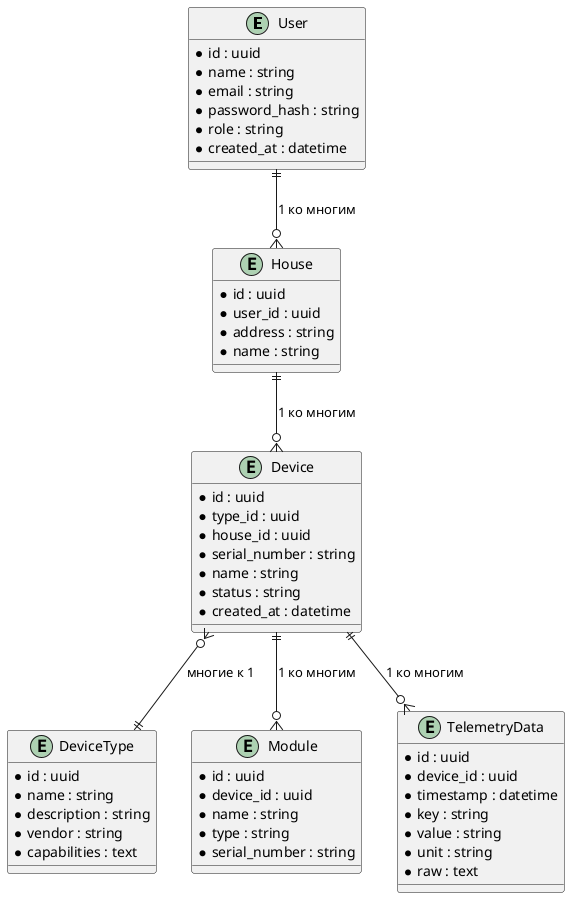

## Идентификация ключевых сущностей
1. User (Пользователь)
   Основной пользователь системы (житель, админ).

2. House (Дом)
   Логическая группа устройств, принадлежащая пользователю.

3. Device (Устройство)
   Физическое или виртуальное устройство, установленное в доме.

4. DeviceType (Тип устройства)
   Определяет модель, возможности и характеристики устройства.

5. Module (Модуль)
   Функциональный блок или подключаемое расширение для устройства.

6. TelemetryData (Телеметрия)
   Массив показаний, поступающих от устройств в разное время.

## Определение атрибутов
1. User
   id — уникальный идентификатор пользователя
   name — имя
   email — адрес электронной почты
   password_hash — хэш пароля
   role — роль в системе (обычно user/admin)
   created_at — дата регистрации
2. House
   id — уникальный идентификатор дома
   user_id — внешний ключ к User
   address — адрес или описание дома
   name — произвольное имя дома («Дача», «Квартира»)
3. Device
   id — уникальный идентификатор устройства
   type_id — внешний ключ к DeviceType
   house_id — внешний ключ к House
   serial_number — серийный номер или обозначение
   name — имя устройства («Термостат в спальне»)
   status — текущее состояние (on/off/error)
   created_at — дата добавления
4. DeviceType
   id — уникальный идентификатор типа
   name — человекочитаемое название («Термостат», «Датчик температуры»)
   description — описание типа/модели
   vendor — производитель
   capabilities — характеристика (JSON или text)
5. Module
   id — уникальный идентификатор модуля
   device_id — внешний ключ к Device
   name — наименование модуля
   type — тип (например, Zigbee, WiFi, реле и т.п.)
   serial_number — серийный номер модуля
6. TelemetryData
   id — уникальный идентификатор записи
   device_id — внешний ключ к Device
   timestamp — время съемки показаний
   key — вид измерения (temperature, humidity, state и др.)
   value — числовое/строковое значение
   unit — единица измерения (°C, %, bool)
   raw — исходное значение/полный JSON (опционально)

#### Основные связи между сущностями
- Один пользователь владеет несколькими домами (`User` → `House`)
- В каждом доме может быть несколько устройств (`House` → `Device`)
- Одно устройство имеет тип (`Device` → `DeviceType`)
- Одно устройство содержит несколько модулей (`Device` → `Module`)
- Одно устройство может иметь множество записей телеметрии (`Device` → `TelemetryData`)

## ER диаграмма 

